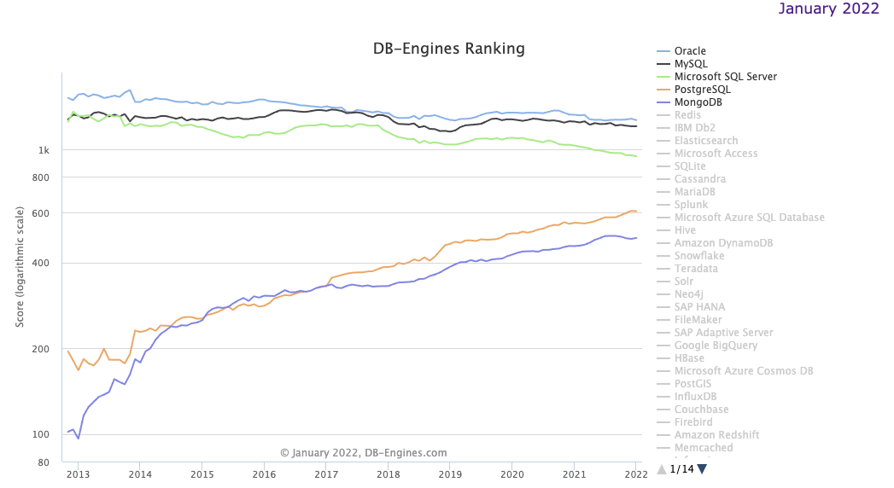

m4_include(../../../setup.m4)

# Lecture 1 - Syllabus - Class Overview

Syllabus

What is a Database

Why is a Database Important

How common are database

What kind of jobs can you get

What is useful about database

Database Trends

