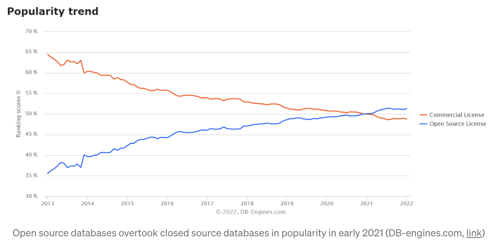

<style>
.pagebreak { page-break-before: always; }
.half { height: 200px; }
</style>
<style>
.pagebreak { page-break-before: always; }
.half { height: 200px; }
.markdown-body {
	font-size: 12px;
}
.markdown-body td {
	font-size: 12px;
}
table {
	border: 1px solid black;
}
</style>


# Lecture 03 - Select
## Jan 25

## Open Source Used More




```
Select [ Projected Columns ]
From Table ...
    join to ...
Where ...
Group By Column List
Having [ where on grouped data ]
Ordr By [ Columns ]
```


Let's use our table from last time

```
  1: \c l02
  2: create table vote_by_county (
  3:     id             serial primary key,
  4:     year           int default 2021,
  5:     state          text default '--',        -- irritatingly all upper case.
  6:     state_uc       text default '--',
  7:     state_po       varchar(2) default '--',     -- Incorrectly Named Column!
  8:     county_name    text default '--',        -- irritatingly all upper case.
  9:     county_name_uc text default '--',
 10:     county_fips    int default 0,
 11:     office         text default 'unk', 
 12:     candidate      text default 'unk', 
 13:     candidate_uc   text default 'unk', 
 14:     party          text default 'unk', 
 15:     candidatevotes int default 0, 
 16:     totalvotes     int default 0,
 17:     version        int,
 18:     vote_mode      text
 19: );

```


and do some selects with the projected columns.

```
select id, year
 from vote_by_county 
;
```

we can rename a column


```
select id, year as "Year of Our Lord"
 from vote_by_county 
;
```

we can pick different columns


File: 01.sql

```
  1: select id, year, state, county_name as "county"
  2:     from vote_by_county 
  3: ;


```

Output:

```
  id   | year |        state         |        county         
-------+------+----------------------+-----------------------
    16 | 2000 | Alabama              | Bibb
  1992 | 2000 | Georgia              | Troup
  4932 | 2000 | Michigan             | Ingham
  5704 | 2000 | Mississippi          | Perry
 12884 | 2004 | Arkansas             | Pope
 ...
 72592 | 2020 | Wyoming              | Sheridan
 72593 | 2020 | Wyoming              | Sheridan
 72594 | 2020 | Wyoming              | Sublette
 72595 | 2020 | Wyoming              | Sublette
 72596 | 2020 | Wyoming              | Sublette
 72597 | 2020 | Wyoming              | Sublette
 72598 | 2020 | Wyoming              | Sweetwater
 72599 | 2020 | Wyoming              | Sweetwater
 72600 | 2020 | Wyoming              | Sweetwater
 72601 | 2020 | Wyoming              | Sweetwater
 72602 | 2020 | Wyoming              | Teton
 72603 | 2020 | Wyoming              | Teton
 72604 | 2020 | Wyoming              | Teton
 72605 | 2020 | Wyoming              | Teton
 72606 | 2020 | Wyoming              | Uinta
 72607 | 2020 | Wyoming              | Uinta
 72608 | 2020 | Wyoming              | Uinta
 72609 | 2020 | Wyoming              | Uinta
 72610 | 2020 | Wyoming              | Washakie
 72611 | 2020 | Wyoming              | Washakie
 72612 | 2020 | Wyoming              | Washakie
 72613 | 2020 | Wyoming              | Washakie
 72614 | 2020 | Wyoming              | Weston
 72615 | 2020 | Wyoming              | Weston
 72616 | 2020 | Wyoming              | Weston
 72617 | 2020 | Wyoming              | Weston
(72617 rows)


```

How about sorting the data

File: 02.sql

```
  1: select id, year, state, county_name
  2:     from vote_by_county 
  3:     order by county_name, state
  4: ;


```

Output:

```
  id   | year |        state         |      county_name      
-------+------+----------------------+-----------------------
 28679 | 2008 | South Carolina       | Abbeville
 38030 | 2012 | South Carolina       | Abbeville
 38029 | 2012 | South Carolina       | Abbeville
 38028 | 2012 | South Carolina       | Abbeville
 28677 | 2008 | South Carolina       | Abbeville
  9148 | 2000 | South Carolina       | Abbeville
  9147 | 2000 | South Carolina       | Abbeville
  9146 | 2000 | South Carolina       | Abbeville
  9145 | 2000 | South Carolina       | Abbeville
 19328 | 2004 | South Carolina       | Abbeville
 19326 | 2004 | South Carolina       | Abbeville
 19327 | 2004 | South Carolina       | Abbeville
 28678 | 2008 | South Carolina       | Abbeville
 ...
 66634 | 2020 | Texas                | Zavala
 66635 | 2020 | Texas                | Zavala
 48759 | 2016 | Texas                | Zavala
 66633 | 2020 | Texas                | Zavala
 47714 | 2016 | South Dakota         | Ziebach
 69518 | 2020 | South Dakota         | Ziebach
 47713 | 2016 | South Dakota         | Ziebach
 47712 | 2016 | South Dakota         | Ziebach
 69516 | 2020 | South Dakota         | Ziebach
 69517 | 2020 | South Dakota         | Ziebach
 38362 | 2012 | South Dakota         | Ziebach
 38363 | 2012 | South Dakota         | Ziebach
 29012 | 2008 | South Dakota         | Ziebach
  9589 | 2000 | South Dakota         | Ziebach
 29011 | 2008 | South Dakota         | Ziebach
 29010 | 2008 | South Dakota         | Ziebach
 19661 | 2004 | South Dakota         | Ziebach
 19660 | 2004 | South Dakota         | Ziebach
  9590 | 2000 | South Dakota         | Ziebach
 19659 | 2004 | South Dakota         | Ziebach
  9591 | 2000 | South Dakota         | Ziebach
 38361 | 2012 | South Dakota         | Ziebach
  9592 | 2000 | South Dakota         | Ziebach
(72617 rows)


```

you can only sort by the columns that you have in the *projected columns*.

you can use the column position

File: 03.sql

```
  1: select id, year, state, county_name
  2:     from vote_by_county 
  3:     order by 4, 3
  4: ;


```

Output:

```
  id   | year |        state         |      county_name      
-------+------+----------------------+-----------------------
 28679 | 2008 | South Carolina       | Abbeville
 38030 | 2012 | South Carolina       | Abbeville
 38029 | 2012 | South Carolina       | Abbeville
 38028 | 2012 | South Carolina       | Abbeville
 28677 | 2008 | South Carolina       | Abbeville
  9148 | 2000 | South Carolina       | Abbeville
  9147 | 2000 | South Carolina       | Abbeville
  9146 | 2000 | South Carolina       | Abbeville
  9145 | 2000 | South Carolina       | Abbeville
 19328 | 2004 | South Carolina       | Abbeville
 19326 | 2004 | South Carolina       | Abbeville
 19327 | 2004 | South Carolina       | Abbeville
 28678 | 2008 | South Carolina       | Abbeville
 47379 | 2016 | South Carolina       | Abbeville
 ...
 38362 | 2012 | South Dakota         | Ziebach
 38363 | 2012 | South Dakota         | Ziebach
 29012 | 2008 | South Dakota         | Ziebach
  9589 | 2000 | South Dakota         | Ziebach
 29011 | 2008 | South Dakota         | Ziebach
 29010 | 2008 | South Dakota         | Ziebach
 19661 | 2004 | South Dakota         | Ziebach
 19660 | 2004 | South Dakota         | Ziebach
  9590 | 2000 | South Dakota         | Ziebach
 19659 | 2004 | South Dakota         | Ziebach
  9591 | 2000 | South Dakota         | Ziebach
 38361 | 2012 | South Dakota         | Ziebach
  9592 | 2000 | South Dakota         | Ziebach
(72617 rows)


```


you can ascending or descending sort

File: 04.sql

```
  1: select id, year, state, county_name
  2:     from vote_by_county 
  3:     order by 4 desc, 3 asc
  4: ;


```

Output:

```
  id   | year |        state         |      county_name      
-------+------+----------------------+-----------------------
  9591 | 2000 | South Dakota         | Ziebach
 19659 | 2004 | South Dakota         | Ziebach
 19660 | 2004 | South Dakota         | Ziebach
 19661 | 2004 | South Dakota         | Ziebach
 38361 | 2012 | South Dakota         | Ziebach
 38362 | 2012 | South Dakota         | Ziebach
 38363 | 2012 | South Dakota         | Ziebach
 29012 | 2008 | South Dakota         | Ziebach
 29011 | 2008 | South Dakota         | Ziebach
  9589 | 2000 | South Dakota         | Ziebach
 29010 | 2008 | South Dakota         | Ziebach
  9592 | 2000 | South Dakota         | Ziebach
  9590 | 2000 | South Dakota         | Ziebach
 47714 | 2016 | South Dakota         | Ziebach
 47713 | 2016 | South Dakota         | Ziebach
 47712 | 2016 | South Dakota         | Ziebach
 69518 | 2020 | South Dakota         | Ziebach
 69517 | 2020 | South Dakota         | Ziebach
 69516 | 2020 | South Dakota         | Ziebach
 48761 | 2016 | Texas                | Zavala
 66637 | 2020 | Texas                | Zavala
 66633 | 2020 | Texas                | Zavala
 ...
  9148 | 2000 | South Carolina       | Abbeville
 38030 | 2012 | South Carolina       | Abbeville
 38029 | 2012 | South Carolina       | Abbeville
 38028 | 2012 | South Carolina       | Abbeville
 28677 | 2008 | South Carolina       | Abbeville
 28678 | 2008 | South Carolina       | Abbeville
 28679 | 2008 | South Carolina       | Abbeville
 19326 | 2004 | South Carolina       | Abbeville
 19327 | 2004 | South Carolina       | Abbeville
(72617 rows)


```

You can apply functions and operators to the columns.  In this case  I will
add 10 to the year and concatenate, `||` the state and county.

File: 05.sql

```
  1: select id, year + 10 as "x", state||', '||county_name as "Location"
  2:     from vote_by_county 
  3:     order by 3
  4: ;


```
Output:

```
  id   |  x   |                  Location                  
-------+------+--------------------------------------------
 31169 | 2022 | Alabama, Autauga
 31168 | 2022 | Alabama, Autauga
 31167 | 2022 | Alabama, Autauga
     1 | 2010 | Alabama, Autauga
 21818 | 2018 | Alabama, Autauga
 21817 | 2018 | Alabama, Autauga
 21816 | 2018 | Alabama, Autauga
 12465 | 2014 | Alabama, Autauga
 12466 | 2014 | Alabama, Autauga
 12467 | 2014 | Alabama, Autauga
     4 | 2010 | Alabama, Autauga
     3 | 2010 | Alabama, Autauga
     2 | 2010 | Alabama, Autauga
 40519 | 2026 | Alabama, Autauga
 50527 | 2030 | Alabama, Autauga
 40518 | 2026 | Alabama, Autauga
 50525 | 2030 | Alabama, Autauga
 ...
 49853 | 2026 | Wyoming, Uinta
 40502 | 2022 | Wyoming, Uinta
 40504 | 2022 | Wyoming, Washakie
 72610 | 2030 | Wyoming, Washakie
 72611 | 2030 | Wyoming, Washakie
 72612 | 2030 | Wyoming, Washakie
 72613 | 2030 | Wyoming, Washakie
 49856 | 2026 | Wyoming, Washakie
 40503 | 2022 | Wyoming, Washakie
 49855 | 2026 | Wyoming, Washakie
 49854 | 2026 | Wyoming, Washakie
 40505 | 2022 | Wyoming, Washakie
 12448 | 2010 | Wyoming, Washakie
 12447 | 2010 | Wyoming, Washakie
 12445 | 2010 | Wyoming, Washakie
 31152 | 2018 | Wyoming, Washakie
 31153 | 2018 | Wyoming, Washakie
 21803 | 2014 | Wyoming, Washakie
 21802 | 2014 | Wyoming, Washakie
 31154 | 2018 | Wyoming, Washakie
 21801 | 2014 | Wyoming, Washakie
 12446 | 2010 | Wyoming, Washakie
 12452 | 2010 | Wyoming, Weston
 12449 | 2010 | Wyoming, Weston
 31156 | 2018 | Wyoming, Weston
 31155 | 2018 | Wyoming, Weston
 12451 | 2010 | Wyoming, Weston
 21806 | 2014 | Wyoming, Weston
 21805 | 2014 | Wyoming, Weston
 21804 | 2014 | Wyoming, Weston
 12450 | 2010 | Wyoming, Weston
 31157 | 2018 | Wyoming, Weston
 49859 | 2026 | Wyoming, Weston
 72616 | 2030 | Wyoming, Weston
 40507 | 2022 | Wyoming, Weston
 49858 | 2026 | Wyoming, Weston
 49857 | 2026 | Wyoming, Weston
 72615 | 2030 | Wyoming, Weston
 40506 | 2022 | Wyoming, Weston
 72617 | 2030 | Wyoming, Weston
 72614 | 2030 | Wyoming, Weston
 40508 | 2022 | Wyoming, Weston
(72617 rows)


```

Single quotes denote string constants.  Double quotes denote things like tables and column names.
If you want an upper-lower case or a table name or column name with blanks then you have to quote
it with double quotes.

Lot's of stuff will fail if you put blanks in your table names.  This is worse than putting blanks
in your file names.  Python will crash with blanks in file names.

We will be using more than one table in queries.  To do this we need to tell SQL the table.
That is done with a table-alias.  In this case *t1*.

File: 06.sql

```
  1: select t1.id, t1.year + 10 as "x", t1.state||', '||t1.county_name as "Location"
  2:     from vote_by_county  as t1
  3:     order by 3 asc
  4: ;


```

There are lots of builtin functions that you can use and all sorts of arithmetic operators
in PostgreSQL that can be applied to the projected columns.  You can also write your own
functions and pass data from the projected columns to the function and get back results.

Languages for functions include PG/SQL - the built in PostgreSQL language and others like
JavaScript, Lua, C, C++, Go etc.   I use PG/SQL and C for processing.   JavaScript is 5 to 10x 
slower than PG/SQL.  C is 10x faster than PG/SQL.  These are rough numbers.   I am a big fan
of Go but I haven't used it for stored-procedure/functions yet in PostgreSQL.

Using a C function requires re-loading and re-starting the database - so it is hard.


Get the list of all of the candidates in the data.

```
  1: select distinct candidate from vote_by_county ;


```

Find out what counties where voted in:


```
  1: 
  2: -- Find the set of counties that voted for "Sleepy Joe" in 2020
  3: 
  4: select t1.state, t1.county_name
  5:     from vote_by_county as t1
  6:     where t1.year = 2020
  7:         and t1.candidate = 'Joseph R Biden Jr'
  8:     order by state, county_name
  9: ;
 10: 
 11: select t1.state, t1.county_name
 12:     from vote_by_county as t1
 13:     where t1.year = 2020
 14:         and t1.candidate = 'Donald J Trump'
 15:     order by state, county_name
 16: ;
 17: 


```

The question is who won?  To find that we have to find the candidate that had the most votes
in each county.  We need to use the "max" in a county.

```
  1: 
  2: -- Find the set of counties that voted for "Sleepy Joe" in 2020
  3: 
  4: select t1.state, t1.county_name
  5: from vote_by_county as t1
  6: where t1.year = 2020
  7:     and t1.candidate = 'Joseph R Biden Jr'
  8:     and t1.candidatevotes = (
  9:         select max(t2.candidatevotes) as max_votes
 10:         from vote_by_county as t2
 11:         where t2.state = t1.state
 12:           and t2.county_name = t1.county_name
 13:     )
 14:     order by state, county_name
 15:     ;
 16: 
 17: 


```


## Operators

[https://www.postgresql.org/docs/9.0/functions.html](https://www.postgresql.org/docs/9.0/functions.html)

There are lots!

<div class="pagebreak"></div>

<table border="1" class="CALSTABLE">
      <colgroup><col>
      <col>
      <col>
      <col>
      </colgroup><thead>
        <tr>
          <th>Operator</th>
          <th>Description</th>
          <th>Example</th>
          <th>Result</th>
        </tr>
      </thead>
      <tbody>
        <tr>
          <td><tt class="LITERAL">+</tt></td>
          <td>addition</td>
          <td><tt class="LITERAL">2 + 3</tt></td>
          <td><tt class="LITERAL">5</tt></td>
        </tr>
        <tr>
          <td><tt class="LITERAL">-</tt></td>
          <td>subtraction</td>
          <td><tt class="LITERAL">2 - 3</tt></td>
          <td><tt class="LITERAL">-1</tt></td>
        </tr>
        <tr>
          <td><tt class="LITERAL">*</tt></td>
          <td>multiplication</td>
          <td><tt class="LITERAL">2 * 3</tt></td>
          <td><tt class="LITERAL">6</tt></td>
        </tr>
        <tr>
          <td><tt class="LITERAL">/</tt></td>
          <td>division (integer division truncates the result)</td>
          <td><tt class="LITERAL">4 / 2</tt></td>
          <td><tt class="LITERAL">2</tt></td>
        </tr>
        <tr>
          <td><tt class="LITERAL">%</tt></td>
          <td>modulo (remainder)</td>
          <td><tt class="LITERAL">5 % 4</tt></td>
          <td><tt class="LITERAL">1</tt></td>
        </tr>
        <tr>
          <td><tt class="LITERAL">^</tt></td>
          <td>exponentiation</td>
          <td><tt class="LITERAL">2.0 ^ 3.0</tt></td>
          <td><tt class="LITERAL">8</tt></td>
        </tr>
        <tr>
          <td><tt class="LITERAL">|/</tt></td>
          <td>square root</td>
          <td><tt class="LITERAL">|/ 25.0</tt></td>
          <td><tt class="LITERAL">5</tt></td>
        </tr>
        <tr>
          <td><tt class="LITERAL">||/</tt></td>
          <td>cube root</td>
          <td><tt class="LITERAL">||/ 27.0</tt></td>
          <td><tt class="LITERAL">3</tt></td>
        </tr>
        <tr>
          <td><tt class="LITERAL">!</tt></td>
          <td>factorial</td>
          <td><tt class="LITERAL">5 !</tt></td>
          <td><tt class="LITERAL">120</tt></td>
        </tr>
        <tr>
          <td><tt class="LITERAL">!!</tt></td>
          <td>factorial (prefix operator)</td>
          <td><tt class="LITERAL">!! 5</tt></td>
          <td><tt class="LITERAL">120</tt></td>
        </tr>
        <tr>
          <td><tt class="LITERAL">@</tt></td>
          <td>absolute value</td>
          <td><tt class="LITERAL">@ -5.0</tt></td>
          <td><tt class="LITERAL">5</tt></td>
        </tr>
        <tr>
          <td><tt class="LITERAL">&amp;</tt></td>
          <td>bitwise AND</td>
          <td><tt class="LITERAL">91 &amp; 15</tt></td>
          <td><tt class="LITERAL">11</tt></td>
        </tr>
        <tr>
          <td><tt class="LITERAL">|</tt></td>
          <td>bitwise OR</td>
          <td><tt class="LITERAL">32 | 3</tt></td>
          <td><tt class="LITERAL">35</tt></td>
        </tr>
        <tr>
          <td><tt class="LITERAL">#</tt></td>
          <td>bitwise XOR</td>
          <td><tt class="LITERAL">17 # 5</tt></td>
          <td><tt class="LITERAL">20</tt></td>
        </tr>
        <tr>
          <td><tt class="LITERAL">~</tt></td>
          <td>bitwise NOT</td>
          <td><tt class="LITERAL">~1</tt></td>
          <td><tt class="LITERAL">-2</tt></td>
        </tr>
        <tr>
          <td><tt class="LITERAL">&lt;&lt;</tt></td>
          <td>bitwise shift left</td>
          <td><tt class="LITERAL">1 &lt;&lt; 4</tt></td>
          <td><tt class="LITERAL">16</tt></td>
        </tr>
        <tr>
          <td><tt class="LITERAL">&gt;&gt;</tt></td>
          <td>bitwise shift right</td>
          <td><tt class="LITERAL">8 &gt;&gt; 2</tt></td>
          <td><tt class="LITERAL">2</tt></td>
        </tr>
      </tbody>
  <table>


<div class="pagebreak"></div>

### string operations

<table border="1" class="CALSTABLE">
      <colgroup><col>
      <col>
      <col>
      <col>
      <col>
      </colgroup><thead>
        <tr>
          <th>Function</th>
          <th>Return Type</th>
          <th>Description</th>
          <th>Example</th>
          <th>Result</th>
        </tr>
      </thead>
      <tbody>
        <tr>
          <td><tt class="LITERAL"><tt class="PARAMETER">string</tt>
          <tt class="LITERAL">||</tt> <tt class="PARAMETER">string</tt></tt></td>
          <td><tt class="TYPE">text</tt></td>
          <td>String concatenation</td>
          <td><tt class="LITERAL">'Post' || 'greSQL'</tt></td>
          <td><tt class="LITERAL">PostgreSQL</tt></td>
        </tr>
        <tr>
          <td><tt class="LITERAL"><tt class="PARAMETER">string</tt>
          <tt class="LITERAL">||</tt> <tt class="PARAMETER">non-string</tt></tt> or <tt class="LITERAL"><tt class="PARAMETER">non-string</tt>
          <tt class="LITERAL">||</tt> <tt class="PARAMETER">string</tt></tt></td>
          <td><tt class="TYPE">text</tt></td>
          <td>String concatenation with one non-string input</td>
          <td><tt class="LITERAL">'Value: ' || 42</tt></td>
          <td><tt class="LITERAL">Value: 42</tt></td>
        </tr>
        <tr>
          <td><tt class="LITERAL"><code class="FUNCTION">bit_length(<tt class="PARAMETER">string</tt>)</code></tt></td>
          <td><tt class="TYPE">int</tt></td>
          <td>Number of bits in string</td>
          <td><tt class="LITERAL">bit_length('jose')</tt></td>
          <td><tt class="LITERAL">32</tt></td>
        </tr>
        <tr>
          <td><tt class="LITERAL"><code class="FUNCTION">char_length(<tt class="PARAMETER">string</tt>)</code></tt> or <tt class="LITERAL"><code class="FUNCTION">character_length(<tt class="PARAMETER">string</tt>)</code></tt></td>
          <td><tt class="TYPE">int</tt></td>
          <td>Number of characters in string</td>
          <td><tt class="LITERAL">char_length('jose')</tt></td>
          <td><tt class="LITERAL">4</tt></td>
        </tr>
        <tr>
          <td><tt class="LITERAL"><code class="FUNCTION">lower(<tt class="PARAMETER">string</tt>)</code></tt></td>
          <td><tt class="TYPE">text</tt></td>
          <td>Convert string to lower case</td>
          <td><tt class="LITERAL">lower('TOM')</tt></td>
          <td><tt class="LITERAL">tom</tt></td>
        </tr>
        <tr>
          <td><tt class="LITERAL"><code class="FUNCTION">octet_length(<tt class="PARAMETER">string</tt>)</code></tt></td>
          <td><tt class="TYPE">int</tt></td>
          <td>Number of bytes in string</td>
          <td><tt class="LITERAL">octet_length('jose')</tt></td>
          <td><tt class="LITERAL">4</tt></td>
        </tr>
        <tr>
          <td><tt class="LITERAL"><code class="FUNCTION">overlay(<tt class="PARAMETER">string</tt>
          placing <tt class="PARAMETER">string</tt> from <tt class="TYPE">int</tt> [<span class="OPTIONAL">for <tt class="TYPE">int</tt></span>])</code></tt></td>
          <td><tt class="TYPE">text</tt></td>
          <td>Replace substring</td>
          <td><tt class="LITERAL">overlay('Txxxxas' placing 'hom'
          from 2 for 4)</tt></td>
          <td><tt class="LITERAL">Thomas</tt></td>
        </tr>
        <tr>
          <td><tt class="LITERAL"><code class="FUNCTION">position(<tt class="PARAMETER">substring</tt>
          in <tt class="PARAMETER">string</tt>)</code></tt></td>
          <td><tt class="TYPE">int</tt></td>
          <td>Location of specified substring</td>
          <td><tt class="LITERAL">position('om' in
          'Thomas')</tt></td>
          <td><tt class="LITERAL">3</tt></td>
        </tr>
        <tr>
          <td><tt class="LITERAL"><code class="FUNCTION">substring(<tt class="PARAMETER">string</tt>
          [<span class="OPTIONAL">from <tt class="TYPE">int</tt></span>] [<span class="OPTIONAL">for
          <tt class="TYPE">int</tt></span>])</code></tt></td>
          <td><tt class="TYPE">text</tt></td>
          <td>Extract substring</td>
          <td><tt class="LITERAL">substring('Thomas' from 2 for
          3)</tt></td>
          <td><tt class="LITERAL">hom</tt></td>
        </tr>
        <tr>
          <td><tt class="LITERAL"><code class="FUNCTION">substring(<tt class="PARAMETER">string</tt>
          from <tt class="REPLACEABLE c3">pattern</tt>)</code></tt></td>
          <td><tt class="TYPE">text</tt></td>
          <td>Extract substring matching POSIX regular expression.
          See <a href="functions-matching.html">Section 9.7</a> for
          more information on pattern matching.</td>
          <td><tt class="LITERAL">substring('Thomas' from
          '...$')</tt></td>
          <td><tt class="LITERAL">mas</tt></td>
        </tr>
        <tr>
          <td><tt class="LITERAL"><code class="FUNCTION">substring(<tt class="PARAMETER">string</tt>
          from <tt class="REPLACEABLE c3">pattern</tt> for
          <tt class="REPLACEABLE c3">escape</tt>)</code></tt></td>
          <td><tt class="TYPE">text</tt></td>
          <td>Extract substring matching <acronym class="ACRONYM">SQL</acronym> regular expression. See <a href="functions-matching.html">Section 9.7</a> for more
          information on pattern matching.</td>
          <td><tt class="LITERAL">substring('Thomas' from
          '%#"o_a#"_' for '#')</tt></td>
          <td><tt class="LITERAL">oma</tt></td>
        </tr>
        <tr>
          <td><tt class="LITERAL"><code class="FUNCTION">trim([<span class="OPTIONAL">leading |
          trailing | both</span>] [<span class="OPTIONAL"><tt class="PARAMETER">characters</tt></span>]
          from <tt class="PARAMETER">string</tt>)</code></tt></td>
          <td><tt class="TYPE">text</tt></td>
          <td>Remove the longest string containing only the
          <tt class="PARAMETER">characters</tt> (a space by
          default) from the start/end/both ends of the <tt class="PARAMETER">string</tt></td>
          <td><tt class="LITERAL">trim(both 'x' from
          'xTomxx')</tt></td>
          <td><tt class="LITERAL">Tom</tt></td>
        </tr>
        <tr>
          <td><tt class="LITERAL"><code class="FUNCTION">upper(<tt class="PARAMETER">string</tt>)</code></tt></td>
          <td><tt class="TYPE">text</tt></td>
          <td>Convert string to upper case</td>
          <td><tt class="LITERAL">upper('tom')</tt></td>
          <td><tt class="LITERAL">TOM</tt></td>
        </tr>
      </tbody>
    </table>


<div class="pagebreak"></div>

### Base Functions

<table border="1" class="CALSTABLE">
      <colgroup><col>
      <col>
      <col>
      <col>
      <col>
      </colgroup><thead>
        <tr>
          <th>Function</th>
          <th>Return Type</th>
          <th>Description</th>
          <th>Example</th>
          <th>Result</th>
        </tr>
      </thead>
      <tbody>
        <tr>
          <td><tt class="LITERAL"><code class="FUNCTION">abs(<tt class="REPLACEABLE c3">x</tt>)</code></tt></td>
          <td>(same as input)</td>
          <td>absolute value</td>
          <td><tt class="LITERAL">abs(-17.4)</tt></td>
          <td><tt class="LITERAL">17.4</tt></td>
        </tr>
        <tr>
          <td><tt class="LITERAL"><code class="FUNCTION">cbrt(<tt class="TYPE">dp</tt>)</code></tt></td>
          <td><tt class="TYPE">dp</tt></td>
          <td>cube root</td>
          <td><tt class="LITERAL">cbrt(27.0)</tt></td>
          <td><tt class="LITERAL">3</tt></td>
        </tr>
        <tr>
          <td><tt class="LITERAL"><code class="FUNCTION">ceil(<tt class="TYPE">dp</tt> or <tt class="TYPE">numeric</tt>)</code></tt></td>
          <td>(same as input)</td>
          <td>smallest integer not less than argument</td>
          <td><tt class="LITERAL">ceil(-42.8)</tt></td>
          <td><tt class="LITERAL">-42</tt></td>
        </tr>
        <tr>
          <td><tt class="LITERAL"><code class="FUNCTION">ceiling(<tt class="TYPE">dp</tt> or <tt class="TYPE">numeric</tt>)</code></tt></td>
          <td>(same as input)</td>
          <td>smallest integer not less than argument (alias for
          <code class="FUNCTION">ceil</code>)</td>
          <td><tt class="LITERAL">ceiling(-95.3)</tt></td>
          <td><tt class="LITERAL">-95</tt></td>
        </tr>
        <tr>
          <td><tt class="LITERAL"><code class="FUNCTION">degrees(<tt class="TYPE">dp</tt>)</code></tt></td>
          <td><tt class="TYPE">dp</tt></td>
          <td>radians to degrees</td>
          <td><tt class="LITERAL">degrees(0.5)</tt></td>
          <td><tt class="LITERAL">28.6478897565412</tt></td>
        </tr>
        <tr>
          <td><tt class="LITERAL"><code class="FUNCTION">div(<tt class="PARAMETER">y</tt> <tt class="TYPE">numeric</tt>, <tt class="PARAMETER">x</tt>
          <tt class="TYPE">numeric</tt>)</code></tt></td>
          <td><tt class="TYPE">numeric</tt></td>
          <td>integer quotient of <tt class="PARAMETER">y</tt>/<tt class="PARAMETER">x</tt></td>
          <td><tt class="LITERAL">div(9,4)</tt></td>
          <td><tt class="LITERAL">2</tt></td>
        </tr>
        <tr>
          <td><tt class="LITERAL"><code class="FUNCTION">exp(<tt class="TYPE">dp</tt> or <tt class="TYPE">numeric</tt>)</code></tt></td>
          <td>(same as input)</td>
          <td>exponential</td>
          <td><tt class="LITERAL">exp(1.0)</tt></td>
          <td><tt class="LITERAL">2.71828182845905</tt></td>
        </tr>
        <tr>
          <td><tt class="LITERAL"><code class="FUNCTION">floor(<tt class="TYPE">dp</tt> or <tt class="TYPE">numeric</tt>)</code></tt></td>
          <td>(same as input)</td>
          <td>largest integer not greater than argument</td>
          <td><tt class="LITERAL">floor(-42.8)</tt></td>
          <td><tt class="LITERAL">-43</tt></td>
        </tr>
        <tr>
          <td><tt class="LITERAL"><code class="FUNCTION">ln(<tt class="TYPE">dp</tt> or <tt class="TYPE">numeric</tt>)</code></tt></td>
          <td>(same as input)</td>
          <td>natural logarithm</td>
          <td><tt class="LITERAL">ln(2.0)</tt></td>
          <td><tt class="LITERAL">0.693147180559945</tt></td>
        </tr>
        <tr>
          <td><tt class="LITERAL"><code class="FUNCTION">log(<tt class="TYPE">dp</tt> or <tt class="TYPE">numeric</tt>)</code></tt></td>
          <td>(same as input)</td>
          <td>base 10 logarithm</td>
          <td><tt class="LITERAL">log(100.0)</tt></td>
          <td><tt class="LITERAL">2</tt></td>
        </tr>
        <tr>
          <td><tt class="LITERAL"><code class="FUNCTION">log(<tt class="PARAMETER">b</tt> <tt class="TYPE">numeric</tt>, <tt class="PARAMETER">x</tt>
          <tt class="TYPE">numeric</tt>)</code></tt></td>
          <td><tt class="TYPE">numeric</tt></td>
          <td>logarithm to base <tt class="PARAMETER">b</tt></td>
          <td><tt class="LITERAL">log(2.0, 64.0)</tt></td>
          <td><tt class="LITERAL">6.0000000000</tt></td>
        </tr>
        <tr>
          <td><tt class="LITERAL"><code class="FUNCTION">mod(<tt class="PARAMETER">y</tt>, <tt class="PARAMETER">x</tt>)</code></tt></td>
          <td>(same as argument types)</td>
          <td>remainder of <tt class="PARAMETER">y</tt>/<tt class="PARAMETER">x</tt></td>
          <td><tt class="LITERAL">mod(9,4)</tt></td>
          <td><tt class="LITERAL">1</tt></td>
        </tr>
        <tr>
          <td><tt class="LITERAL"><code class="FUNCTION">pi()</code></tt></td>
          <td><tt class="TYPE">dp</tt></td>
          <td><span class="QUOTE">"π"</span> constant</td>
          <td><tt class="LITERAL">pi()</tt></td>
          <td><tt class="LITERAL">3.14159265358979</tt></td>
        </tr>
        <tr>
          <td><tt class="LITERAL"><code class="FUNCTION">power(<tt class="PARAMETER">a</tt> <tt class="TYPE">dp</tt>, <tt class="PARAMETER">b</tt> <tt class="TYPE">dp</tt>)</code></tt></td>
          <td><tt class="TYPE">dp</tt></td>
          <td><tt class="PARAMETER">a</tt> raised to the power of
          <tt class="PARAMETER">b</tt></td>
          <td><tt class="LITERAL">power(9.0, 3.0)</tt></td>
          <td><tt class="LITERAL">729</tt></td>
        </tr>
        <tr>
          <td><tt class="LITERAL"><code class="FUNCTION">power(<tt class="PARAMETER">a</tt> <tt class="TYPE">numeric</tt>, <tt class="PARAMETER">b</tt>
          <tt class="TYPE">numeric</tt>)</code></tt></td>
          <td><tt class="TYPE">numeric</tt></td>
          <td><tt class="PARAMETER">a</tt> raised to the power of
          <tt class="PARAMETER">b</tt></td>
          <td><tt class="LITERAL">power(9.0, 3.0)</tt></td>
          <td><tt class="LITERAL">729</tt></td>
        </tr>
        <tr>
          <td><tt class="LITERAL"><code class="FUNCTION">radians(<tt class="TYPE">dp</tt>)</code></tt></td>
          <td><tt class="TYPE">dp</tt></td>
          <td>degrees to radians</td>
          <td><tt class="LITERAL">radians(45.0)</tt></td>
          <td><tt class="LITERAL">0.785398163397448</tt></td>
        </tr>
        <tr>
          <td><tt class="LITERAL"><code class="FUNCTION">round(<tt class="TYPE">dp</tt> or <tt class="TYPE">numeric</tt>)</code></tt></td>
          <td>(same as input)</td>
          <td>round to nearest integer</td>
          <td><tt class="LITERAL">round(42.4)</tt></td>
          <td><tt class="LITERAL">42</tt></td>
        </tr>
        <tr>
          <td><tt class="LITERAL"><code class="FUNCTION">round(<tt class="PARAMETER">v</tt> <tt class="TYPE">numeric</tt>, <tt class="PARAMETER">s</tt>
          <tt class="TYPE">int</tt>)</code></tt></td>
          <td><tt class="TYPE">numeric</tt></td>
          <td>round to <tt class="PARAMETER">s</tt> decimal
          places</td>
          <td><tt class="LITERAL">round(42.4382, 2)</tt></td>
          <td><tt class="LITERAL">42.44</tt></td>
        </tr>
        <tr>
          <td><tt class="LITERAL"><code class="FUNCTION">sign(<tt class="TYPE">dp</tt> or <tt class="TYPE">numeric</tt>)</code></tt></td>
          <td>(same as input)</td>
          <td>sign of the argument (-1, 0, +1)</td>
          <td><tt class="LITERAL">sign(-8.4)</tt></td>
          <td><tt class="LITERAL">-1</tt></td>
        </tr>
        <tr>
          <td><tt class="LITERAL"><code class="FUNCTION">sqrt(<tt class="TYPE">dp</tt> or <tt class="TYPE">numeric</tt>)</code></tt></td>
          <td>(same as input)</td>
          <td>square root</td>
          <td><tt class="LITERAL">sqrt(2.0)</tt></td>
          <td><tt class="LITERAL">1.4142135623731</tt></td>
        </tr>
        <tr>
          <td><tt class="LITERAL"><code class="FUNCTION">trunc(<tt class="TYPE">dp</tt> or <tt class="TYPE">numeric</tt>)</code></tt></td>
          <td>(same as input)</td>
          <td>truncate toward zero</td>
          <td><tt class="LITERAL">trunc(42.8)</tt></td>
          <td><tt class="LITERAL">42</tt></td>
        </tr>
        <tr>
          <td><tt class="LITERAL"><code class="FUNCTION">trunc(<tt class="PARAMETER">v</tt> <tt class="TYPE">numeric</tt>, <tt class="PARAMETER">s</tt>
          <tt class="TYPE">int</tt>)</code></tt></td>
          <td><tt class="TYPE">numeric</tt></td>
          <td>truncate to <tt class="PARAMETER">s</tt> decimal
          places</td>
          <td><tt class="LITERAL">trunc(42.4382, 2)</tt></td>
          <td><tt class="LITERAL">42.43</tt></td>
        </tr>
        <tr>
          <td><tt class="LITERAL"><code class="FUNCTION">width_bucket(<tt class="PARAMETER">op</tt>
          <tt class="TYPE">numeric</tt>, <tt class="PARAMETER">b1</tt> <tt class="TYPE">numeric</tt>,
          <tt class="PARAMETER">b2</tt> <tt class="TYPE">numeric</tt>, <tt class="PARAMETER">count</tt>
          <tt class="TYPE">int</tt>)</code></tt></td>
          <td><tt class="TYPE">int</tt></td>
          <td>return the bucket to which <tt class="PARAMETER">operand</tt> would be assigned in an
          equidepth histogram with <tt class="PARAMETER">count</tt>
          buckets, in the range <tt class="PARAMETER">b1</tt> to
          <tt class="PARAMETER">b2</tt></td>
          <td><tt class="LITERAL">width_bucket(5.35, 0.024, 10.06,
          5)</tt></td>
          <td><tt class="LITERAL">3</tt></td>
        </tr>
        <tr>
          <td><tt class="LITERAL"><code class="FUNCTION">width_bucket(<tt class="PARAMETER">op</tt>
          <tt class="TYPE">dp</tt>, <tt class="PARAMETER">b1</tt>
          <tt class="TYPE">dp</tt>, <tt class="PARAMETER">b2</tt>
          <tt class="TYPE">dp</tt>, <tt class="PARAMETER">count</tt> <tt class="TYPE">int</tt>)</code></tt></td>
          <td><tt class="TYPE">int</tt></td>
          <td>return the bucket to which <tt class="PARAMETER">operand</tt> would be assigned in an
          equidepth histogram with <tt class="PARAMETER">count</tt>
          buckets, in the range <tt class="PARAMETER">b1</tt> to
          <tt class="PARAMETER">b2</tt></td>
          <td><tt class="LITERAL">width_bucket(5.35, 0.024, 10.06,
          5)</tt></td>
          <td><tt class="LITERAL">3</tt></td>
        </tr>
      </tbody>
    </table>

How About the square root operator!

File: 07.sql

```

select |/25.0;


```

and a factorial operator!

```
select 5!;
```
and

```
select !! 5;
```

That is *FUN* !  Not 1 but 2 factorial operators.


