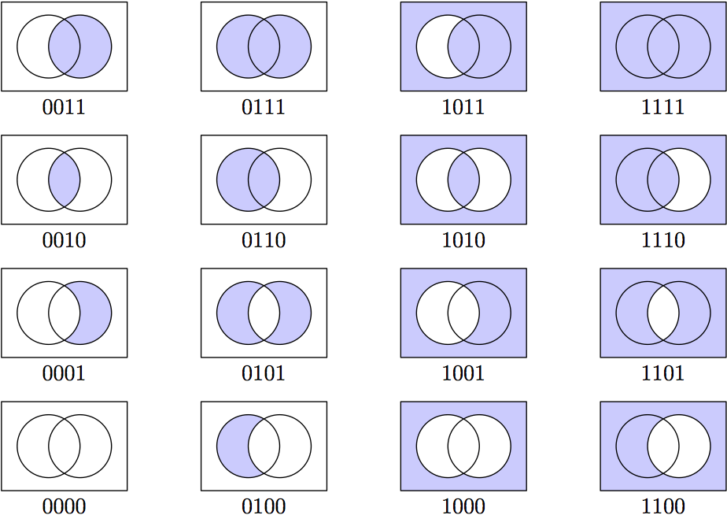

<style>
.pagebreak { page-break-before: always; }
.half { height: 200px; }
</style>
<style>
.pagebreak { page-break-before: always; }
.half { height: 200px; }
.markdown-body {
	font-size: 12px;
}
.markdown-body td {
	font-size: 12px;
}
table {
	border: 1px solid black;
}
</style>


# Lecture 06 - Joins

## Feb 1



There are 16 of them.

Let's work through all of them in PostgreSQL.

Tables and data for exampels:

```
  1: drop table if exists marketing_data ;
  2: create table if not exists marketing_data (
  3:     name text,
  4:     amount int,
  5:     phone_no text
  6: );
  7: drop table if exists do_not_call_list ;
  8: create table if not exists do_not_call_list (
  9:     phone_no text,
 10:     when_added timestamp 
 11: );
 12: insert into marketing_data (name, amount, phone_no) values
 13:     ( 'philip', 5000, '720-209-7888')
 14:     ,('bob', 25000, '505-444-1212')
 15:     ,('mark', 200, '307-338-1212')
 16:     ,('dave', -200, '307-130-1212')
 17: ;
 18: insert into do_not_call_list ( phone_no, when_added ) values
 19:      ('505-444-1212','2021-02-04T13:14:15')
 20:     ,('505-222-1212','2020-01-03T13:14:15')
 21: ;

m4_ omment(

drop table if exists marketing_data ;
create table if not exists marketing_data (
	name text,
	phone_no text
);
drop table if exists do_not_call_list ;
create table if not exists do_not_call_list (
	phone_no text
);
insert into marketing_data (name, phone_no) values
	( 'philip', '720-209-7888')
	,('bob', '505-444-1212')
	,('mark', '307-338-1212')
;
insert into do_not_call_list ( phone_no ) values
	 ('505-444-1212')
;

)
```


The JOIN types in Postgres are

- INNER JOIN, or just JOIN - this is the most common.
- The CROSS JOIN
- The LEFT OUTER JOIN
- The RIGHT OUTER JOIN
- The FULL OUTER JOIN

and we can use them do do most of the possible ven diagrams above.
The ven diagrams that we can not do are also useful - so I will
show you all 16.

On the web: [https://www.postgresqltutorial.com/postgresql-joins/](https://www.postgresqltutorial.com/postgresql-joins/)
or [https://www.tutorialspoint.com/postgresql/postgresql_using_joins.htm](https://www.tutorialspoint.com/postgresql/postgresql_using_joins.htm)
.


## 0 0000 - the set of NO data.

```
select 'a' as "x"
	where 1 = 2
;
```

Useful for checking if a program has a connection to the database.


## 3 0011 and 6 0110 - Select from a single table. 

This is the not-joined condition.

```
  1: select * from marketing_data;
  2: select * from do_not_call_list;


```


## 2 0010 - Intersection of 2 sets

This is the `inner` join between 2 sets of data.

```
  1: select name
  2:     from marketing_data as t1
  3:         join do_not_call_list as t2 on ( t1.phone_no = t2.phone_no)
  4: ;


```

or INNER JOIN

```
  1: select name
  2:     from marketing_data as t1
  3:         inner join do_not_call_list as t2 on ( t1.phone_no = t2.phone_no)
  4: ;


```

or in the where clause

```
  1: select t1.name
  2:     from marketing_data as t1, do_not_call_list as t2
  3:     where t1.phone_no = t2.phone_no
  4: ;


```


## 15 - 1111 - Select with no conditions.

This is useful for doing calculations in PostgreSQL.

```
select 12 * 33;
```

(In Oracle....)

```
select 12 * 33 from dual;
```

Or generate a series:

```
SELECT generate_series(3, 100) / 3;
```


## 8 1000 - Except (minus) Operations.

(this also coves 9, 10, 11, 12, 13, 14 when the 2nd select (after the minus) is
one of the other join that we have already shown)

Remove from a fixed list a set of things

```
  1: select t1.phone_no
  2:     from marketing_data as t1
  3: except 
  4:     select t2.phone_no
  5:     from do_not_call_list as t2
  6: ;


```

In Oracle, DB2, MS-SQL-Server, MariaDB and mySQL:

```
  1: select t1.phone_no
  2:     from marketing_data as t1
  3: minus 
  4:     select t2.phone_no
  5:     from do_not_call_list as t2
  6: ;

```

This is really good for things like products that are out of stock!


## 1 0001 

This gives us just the numbes in the do-not-call list that are not in the 
set of marketing data.

```
  1: select name, when_added
  2:     from marketing_data as t1
  3:         right join do_not_call_list as t2 on ( t1.phone_no = t2.phone_no)
  4:         where t1.phone_no is null 
  5: ;


```


## 4 0100 

This is like 1 or the "minus" above with the tables switched.

```
  1: select name, t1.phone_no, when_added
  2:     from marketing_data as t1
  3:         left join do_not_call_list as t2 on ( t1.phone_no = t2.phone_no)
  4:         where t2.phone_no is null 
  5: ;


```


## 5 0101 


```
  1: select name, when_added
  2:     from marketing_data as t1
  3:         full outer join do_not_call_list as t2 on ( t1.phone_no = t2.phone_no)
  4:         where t1.phone_no is null 
  5:             or t2.phone_no is null
  6: ;


```


## 7 0111 - full outer join


```
  1: select name, when_added
  2:     from marketing_data as t1
  3:         full join do_not_call_list as t2 on ( t1.phone_no = t2.phone_no)
  4: ;


```

FULL OUTER

```
  1: select name, when_added
  2:     from marketing_data as t1
  3:         full outer join do_not_call_list as t2 on ( t1.phone_no = t2.phone_no)
  4: ;


```


## Cross Join

This is the one that is not in the VEN diagram - that is all of the left table with all of the right
table.   This is more of a "join-all-together so I can post filer" or "join-all-together so I can
construct new data from it" operation.

Given our little set of data this makes no sense.   Oh... Well...

```
  1: select * 
  2:     from marketing_data as t1
  3:         cross join do_not_call_list as t2 
  4: ;

```

or

```
  1: select * 
  2:     from marketing_data as t1
  3:         , do_not_call_list as t2 
  4: ;

```


